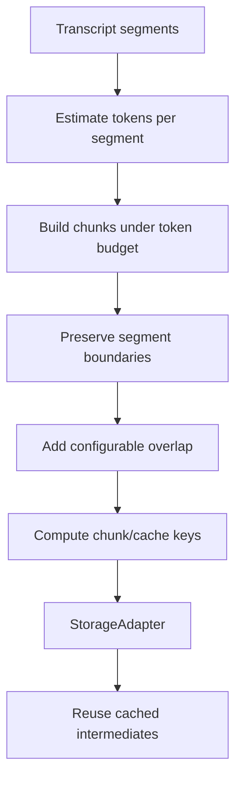

# Issue #3 Plan: Timestamp-Aware Chunking and Cache Keys

## Goal

Build the chunking and cache-key layer that prevents repeated LLM spend while preserving timestamp citation ability.

Issue #3 scope is intentionally narrow:

- Chunk transcript segments by configurable token budget.
- Preserve timestamp boundaries and source segment IDs.
- Keep overlap small and configurable.
- Generate deterministic cache keys for transcript-derived stages.
- Add resumable cache helpers so later pipeline stages can skip work when inputs are unchanged.

This issue does not implement artifact generation, embeddings, retrieval QA, or paid transcription.

## Current Inputs

The current SDK already has:

- `Transcript` and `TranscriptSegment` from issue #4.
- `TranscriptChunk` contract with `id`, `videoId`, `startSeconds`, `endSeconds`, `text`, `sourceSegmentIds`, and `tokenEstimate`.
- `StorageAdapter` for cache-backed resumability.
- Existing deterministic key helpers from source and transcript work.

## Design



## Chunking Rules

| Concern | Decision |
| --- | --- |
| Token estimator | Start with dependency-free approximate estimator. Default: `ceil(chars / 4)`, minimum `1` for non-empty text. |
| Segment boundaries | Do not split a transcript segment unless it alone exceeds the chunk budget. |
| Oversized segment | Keep it as its own chunk and mark `tokenEstimate` over budget rather than destroying timestamp provenance. |
| Chunk ID | Deterministic: `${videoId}:chunk:${index}` by default. |
| Chunk timestamps | `startSeconds` from first source segment, `endSeconds` from last source segment. |
| Chunk text | Join segment text with newline for readable context. |
| Overlap | Configurable by segment count, default `0`, kept small. Overlap copies tail segment IDs from previous chunk into next chunk. |
| Empty segments | Ignore empty text segments. |

## Cache Keys

Add one generic key helper for pipeline work:

```ts
createPipelineCacheKey({
  namespace,
  task,
  inputHash,
  model,
  promptVersion,
  options,
})
```

Expected key families:

- Transcript cache key already exists from issue #4.
- Chunk cache key: transcript source hash + chunker version + chunk options.
- Embedding cache key: embedding model + chunk hash + embedding options.
- Artifact/LLM cache key: task + model + prompt version + input hash + options.

## Resumability

Add a small helper around `StorageAdapter`:

```ts
getOrComputeCached(storage, key, compute)
```

Behavior:

- If cache hit: return cached value and `cacheHit: true`.
- If miss: compute once, store result, return `cacheHit: false`.
- Do not swallow compute errors.

This is enough for later issues to skip LLM calls without forcing a full workflow engine into the core.

## Tests

- Chunking preserves timestamps and source segment IDs.
- Chunking respects token budget for normal segments.
- Oversized segment stays intact as one chunk.
- Overlap is configurable and deterministic.
- Empty segments are ignored.
- Chunk IDs are deterministic.
- Chunk cache keys are stable across option key order and change when options change.
- Pipeline cache keys include task, model, prompt version, input hash, and options.
- `getOrComputeCached()` skips compute on cache hit.

## Verification

- `npm run typecheck`
- `npm test`
- `npm run build`
- `npm pack --dry-run`
- `npm audit --audit-level=critical`
