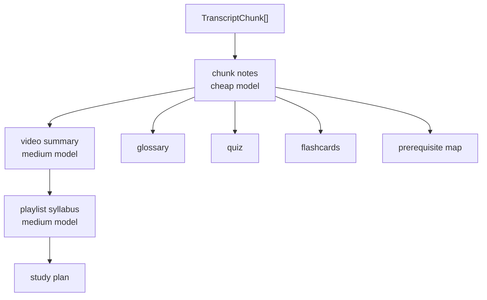

# Issue #6 Plan: Low-Cost Learning Artifact Engine

## Goal

Generate useful learning artifacts without sending full transcripts or full playlists to expensive models.

Issue #6 should provide a composable artifact engine that:

- Generates chunk notes from transcript chunks with a cheap model role.
- Synthesizes video summaries from chunk notes with a medium model role.
- Synthesizes playlist syllabus and study plan from compressed video summaries.
- Supports requested outputs only.
- Uses strict Zod schemas and prompt versions.
- Stores artifact cache keys so repeated runs skip LLM work.
- Preserves timestamp references wherever the artifact type can cite source transcript ranges.

This issue does not implement retrieval QA, embeddings execution, player contracts, or Skillware integration.

## Architecture

## Data Flow

| Stage | Input | Output | Model role |
| --- | --- | --- | --- |
| Chunk notes | `TranscriptChunk[]` | one notes artifact per chunk | cheap |
| Video summary | chunk notes for one video | one summary artifact per video | medium |
| Playlist syllabus | video summaries | syllabus artifact | medium |
| Glossary | chunk notes | glossary artifact | cheap |
| Quiz | chunk notes | quiz artifact | cheap |
| Flashcards | chunk notes | flashcards artifact | cheap |
| Study plan | video summaries or syllabus | study plan artifact | medium |
| Prerequisite map | chunk notes and summaries | prerequisite map artifact | medium |

## Caching

Every LLM call gets a deterministic artifact cache key using:

- `task`
- `model`
- `promptVersion`
- `inputHash`
- relevant options

The engine should use `getOrComputeCached()` from issue #3 so repeated runs skip LLM calls.

## Schemas

Use Zod schemas for every artifact payload:

- `chunkNotesSchema`
- `videoSummarySchema`
- `playlistSyllabusSchema`
- `glossarySchema`
- `quizSchema`
- `flashcardsSchema`
- `studyPlanSchema`
- `prerequisiteMapSchema`

Each schema should keep citation/timestamp ranges where useful.

## Tests

- Schema validation accepts valid payloads and rejects invalid payloads.
- Engine generates only requested outputs.
- Chunk notes are generated before dependent video-level artifacts.
- Playlist-level artifacts use video summaries, not raw full transcripts.
- Cache hit skips LLM adapter calls.
- Artifacts include prompt version, model role, and cache key.
- Timestamp citations survive from chunks to chunk notes and video summaries.

## Verification

- `npm run typecheck`
- `npm test`
- `npm run build`
- `npm pack --dry-run`
- `npm audit --audit-level=critical`
