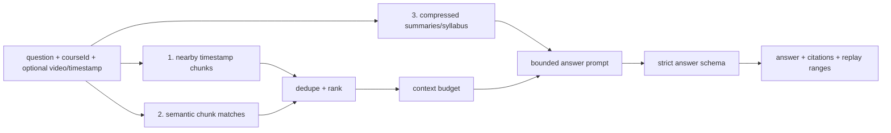

# Issue #7 Plan: Retrieval QA With Timestamp Citations

## Goal

Implement the `ask()` path for questions over a video, timestamp, or playlist while keeping context small and citation-backed.

Issue #7 should provide:

- Timestamp-nearby chunk retrieval first when `timestampSeconds` is present.
- Semantic retrieval after nearby context when embeddings are configured.
- Compressed course context from summary/syllabus artifacts, not raw full transcripts.
- Bounded context budgets.
- Strict answer schema requiring citations, replay ranges, follow-up questions, and confidence metadata.
- SDK integration through an optional QA engine so existing lightweight SDK setup still works.

## Retrieval Order



## Design

Add a small `RetrievalQaEngine` adapter:

```ts
type RetrievalQaEngine = {
  ask(input: AskAtTimestampInput): Promise<AskResponse>;
};
```

`createYoutubeLearningSdk({ qa })` delegates `ask()` to the configured engine after input validation. Without `qa`, the current insufficient-context fallback remains.

## Context Sources

| Source | Use |
| --- | --- |
| `TranscriptChunk[]` | Primary answer grounding and citation source. |
| Optional chunk embeddings | Semantic retrieval if provided with `EmbeddingsAdapter`. |
| Summary/syllabus artifacts | Compressed course context only. Never pass raw full playlist transcript. |

## Retrieval Rules

| Situation | Behavior |
| --- | --- |
| Timestamp question | Retrieve same-video chunks nearest to timestamp first. |
| Video-only question | Retrieve chunks from that video before playlist-wide chunks. |
| Playlist-wide question | Retrieve across all chunks, bounded by top-K/token budget. |
| Semantic configured | Embed query, score chunks by cosine similarity, append after timestamp-nearby chunks. |
| No relevant context | Return `insufficient_context` without inventing citations. |
| LLM answer has no citations | Schema validation should reject it or engine should return insufficient context. |

## Tests

- Timestamp retrieval ranks nearby chunks before semantic matches.
- Video-only ask filters first by video ID.
- Playlist ask can retrieve across videos.
- Context budget limits chunks passed to LLM.
- Summary context is included from artifacts, not raw transcript text.
- Answer schema rejects missing citations for answered responses.
- SDK `ask()` delegates to configured QA engine.
- SDK `ask()` keeps insufficient-context fallback when no QA engine is configured.

## Verification

- `npm run typecheck`
- `npm test`
- `npm run build`
- `npm pack --dry-run`
- `npm audit --audit-level=critical`
