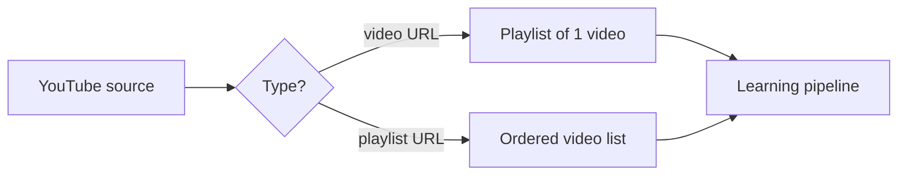
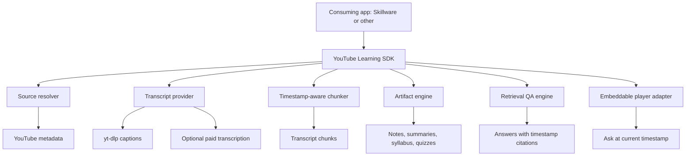
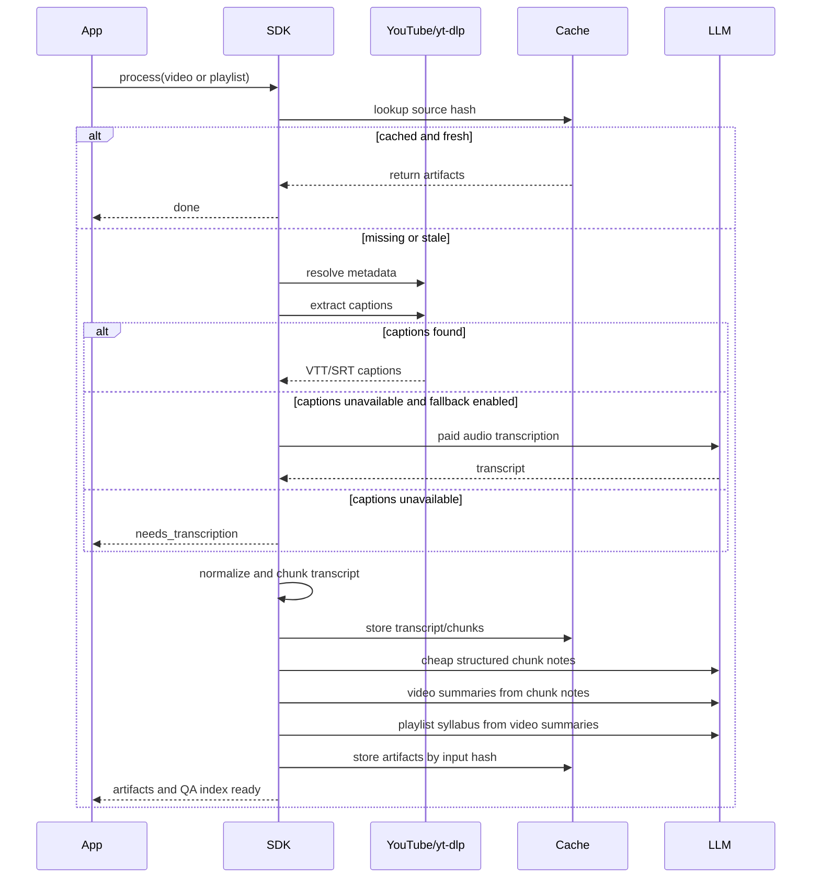
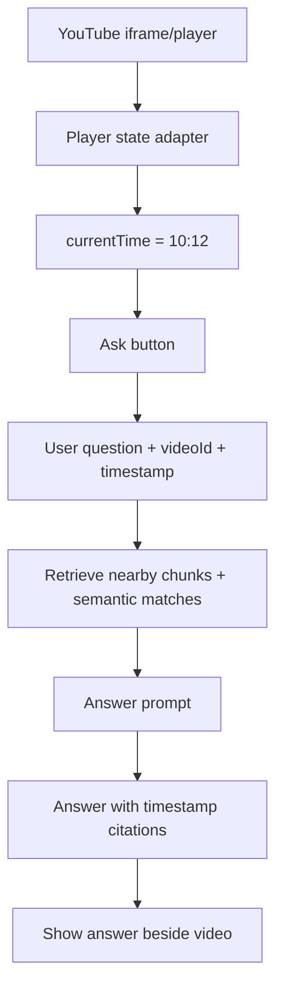

# YouTube Learning SDK Plan

## Goal

Build an open-source TypeScript SDK that turns public YouTube videos and
playlists into learning artifacts and timestamp-aware AI help, while minimizing
cost, latency, and hallucination risk.

The SDK must support:

- a single YouTube video
- a YouTube playlist
- transcript extraction
- AI summaries
- specialized notes
- syllabus generation
- explanation of individual points
- question answering across a video or playlist
- embeddable video playback surfaces
- an "Ask" interaction at the current timestamp

## Non-Goals

- Supporting paid course platforms in v1.
- Building Skillware-specific persistence into the core package.
- Using paid transcription as the default.
- Sending an entire playlist transcript into one LLM call.

## Language

Use TypeScript.

Skillware is already TypeScript, pnpm, and Node/Bun oriented. A TypeScript SDK is
easy for Skillware to import, easy to publish to npm, and can still call `yt-dlp`
as a subprocess through a provider adapter.

## Product Model

A video is a playlist with one item.



## Core Architecture



## Cheap-First Pipeline



## Cost Strategy

Default behavior:

- Use `yt-dlp` captions first.
- Prefer human captions over auto captions.
- Prefer requested language, then English, then detected available language.
- Do not use paid transcription unless explicitly enabled.
- Cache transcript by `videoId + language + provider + transcriptHash`.
- Cache LLM outputs by `task + model + promptVersion + inputHash`.
- Generate artifacts hierarchically: chunk -> video -> playlist.
- Use retrieval for QA instead of stuffing full transcripts into context.

LLM routing:

- Cheap model: transcript cleanup, chunk notes, glossary, flashcards, quiz.
- Medium model: video-level summaries, specialized notes, syllabus synthesis.
- Strong model: optional deep explanations or final course design polish.

Prompt strategy:

- Use strict JSON schemas.
- Keep prompts short and task-specific.
- Include transcript chunks with timestamps.
- Ask for citations to timestamp ranges.
- Store prompt versions so cache invalidation is controlled.

## Latency Strategy

- Process playlist videos concurrently with a configurable limit.
- Emit progress events for every stage.
- Persist partial results so a failed playlist can resume.
- Stream early artifacts: transcript first, summary next, syllabus later.
- Build QA index as soon as chunks are ready.

## Accuracy Strategy

- Preserve transcript provenance: provider, language, caption kind, hash.
- Keep timestamp segments all the way through notes and answers.
- Require answers to cite transcript ranges.
- Separate transcript cleanup from conceptual explanation.
- Mark low-confidence transcript regions instead of hiding them.
- Prefer "I do not have enough context" over invented answers.

## Embeddable Video and Ask UX

The SDK should expose a headless player-state contract and optional UI adapters.
Skillware can use this to embed a YouTube player and attach an Ask button.



Ask behavior:

- If the user asks at `10:12`, retrieve chunks around that timestamp first.
- Add semantic matches only after local timestamp context.
- Include playlist-level/course context as compressed summaries, not raw text.
- Return answer, citations, suggested replay ranges, and follow-up questions.

## Public SDK Shape

```ts
const sdk = createYoutubeLearningSdk({
  llm,
  storage,
  embeddings,
  transcriptProvider,
});

await sdk.process({
  source: { type: "video", url },
  outputs: ["transcript", "summary", "notes", "qa"],
});

await sdk.process({
  source: { type: "playlist", url },
  outputs: ["transcripts", "summaries", "syllabus", "qa"],
});

await sdk.ask({
  courseId,
  videoId,
  timestampSeconds: 612,
  question: "I do not understand this part. Can you explain it?",
});
```

## Package Boundaries

Core package:

- source parsing and resolving
- transcript contracts
- VTT/SRT normalization
- chunking
- artifact generation contracts
- cache keys
- QA contracts
- player-state contracts

Adapters:

- `yt-dlp` transcript provider
- OpenAI-compatible LLM adapter
- AI SDK adapter
- in-memory storage
- filesystem storage
- Skillware adapter later
- React player/Ask adapter later

## Implementation Milestones

1. Repo and SDK foundations.
2. YouTube source resolver.
3. Caption-first transcript extraction.
4. Chunking and cache keys.
5. Low-cost artifact engine.
6. Timestamp-aware QA.
7. Embeddable player and Ask contract.
8. Skillware adapter.

## Key Risks

- YouTube caption extraction can break.
- Auto captions may be inaccurate for technical content.
- Long playlists can create runaway cost if caching fails.
- QA can hallucinate without citation discipline.
- UI consumers may want player features the headless SDK does not own.

Mitigations:

- Make transcript provider pluggable.
- Make paid transcription opt-in.
- Make every artifact cacheable and resumable.
- Require timestamp citations.
- Keep UI adapter optional and headless contract stable.
